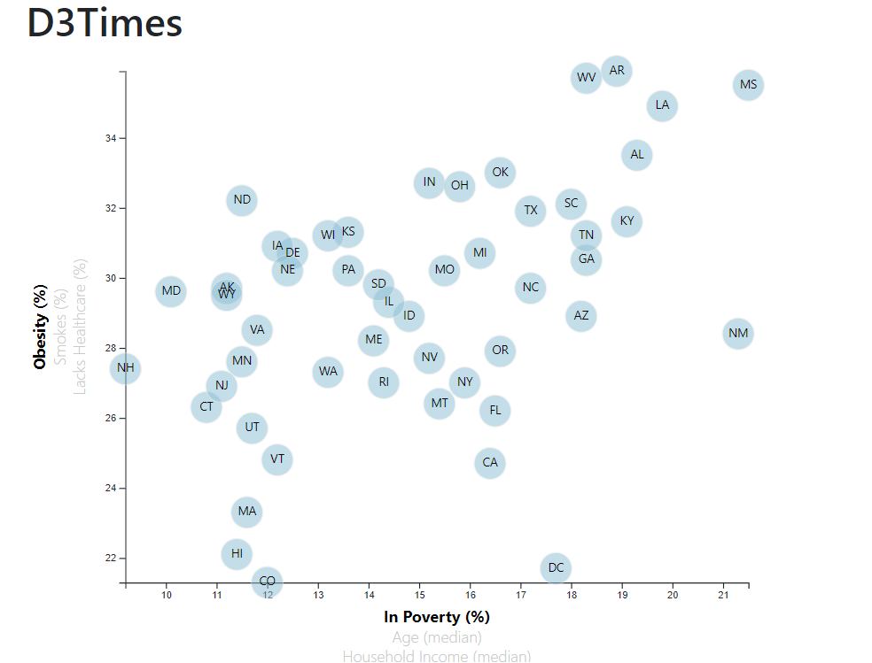
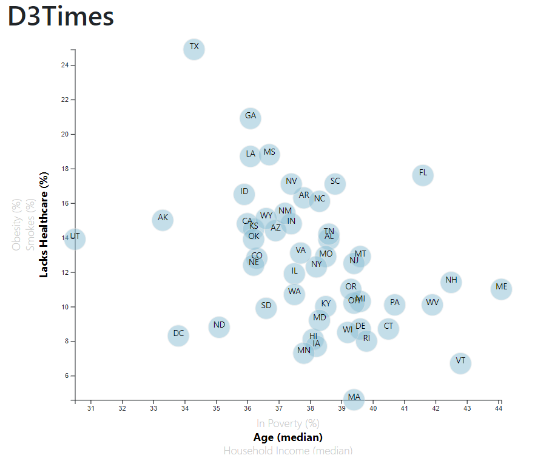

# Health Risks by Demographics with D3.js
The purpose of this project is to see health risks facing particular demographics by visualising through a single scatter plot that if poverty, age, or household income has any correlation to obesity, smoking or lack of healthcare. With a single scatter plot, 9 different correlations are being visulaized.  

## Tools and Technologies used
* Javascript- D3.js
* HTML
* CSS

## How to run the code
Go to [this link](https://akshitap31.github.io/Health-Risk-demog-D3.js/index.html), you can change the X and Y axis by clicking on the inactive one's, you can also hover over the plots to see data, and scroll down for observations noted.

## Output

## Data Source
[https://factfinder.census.gov/faces/nav/jsf/pages/searchresults.xhtml](https://factfinder.census.gov/faces/nav/jsf/pages/searchresults.xhtml)

 

